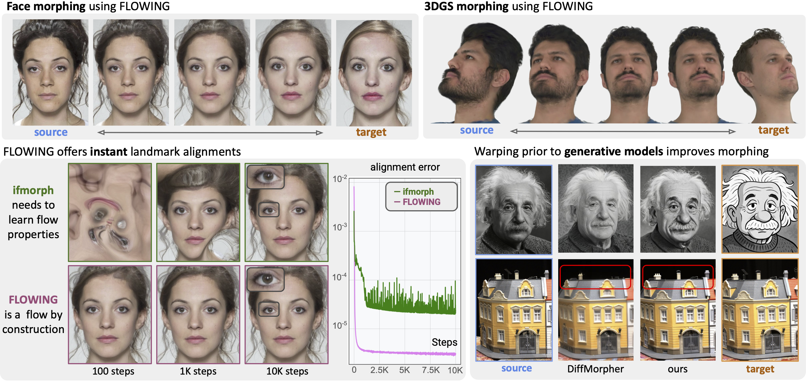

# FLOWING 🌊: Implicit Neural Flows for Structure-Preserving Morphing
[Arthur Bizzi [1]](),
[Matias Grynberg Portnoy [2]](https://www.linkedin.com/in/mgp123),
[Vitor Pereira Matias [3]](),
[Daniel Perazzo [4]](https://www.linkedin.com/in/daniel-perazzo-85a0a3175),
[João Paulo Lima [5]](https://jpsml.github.io),
[Luiz Velho [4]](https://lvelho.impa.br/),
[Nuno Gonçalves [6,7]](https://home.deec.uc.pt/~nunogon/),
[João M. Pereira[8]](https://joaompereira.github.io/),
[Guilherme Schardong [6]](https://schardong.github.io/),
[Tiago Novello [4]](https://sites.google.com/site/tiagonovellodebrito)
<br>
[1] École Polytechnique Fédérale de Lausanne (EPFL),
<br>
[2] Buenos Aires University (UBA),
<br>
[3] University of São Paulo (USP),
<br>
[4] Institute for Pure and Applied Mathematics (IMPA),
<br>
[5] Federal Rural University of Pernambuco (UFRPE),
<br>
[6] Institute of Systems and Robotics, University of Coimbra (ISR-UC),
<br>
[7] Portuguese Mint and Official Printing Office (INCM),
<br>
[8] University of Georgia (UGA)

This is the official implementation of "FLOWING 🌊: Implicit Neural Flows for Structure-Preserving Morphing", to appear on NeurIPS 2025. Meanwhile, check the [arXiv version](https://arxiv.org/abs/2510.09537). More results and examples in the [project page](https://schardong.github.io/flowing).

**Note that this repository is not ready yet!**



## Getting started

**TL-DR**:If you just want to run the code, follow the steps below (assuming a UNIX-like system with Make installed). For more details, jump to `Setup and sample run` section.

```{sh}
python -m venv .venv
source .venv/bin/activate
pip install -r requirements.txt
pip install -e .
make data/frll_neutral_front data/frll_neutral_front_cropped
...
```

### Prerequisites
1. [Python](https://www.python.org/)
2. [venv](https://docs.python.org/3/library/venv.html) or [PyEnv](https://github.com/pyenv/pyenv)
3. [Git](https://git-scm.com/download) (or just download a tarball of the repository)

Basically, you need Python to run the code, a GPU with GPGPU drivers installed (e.g. CUDA drivers and toolkit on an NVidia GPU). Optionally, you may want to use virtual environments (venv, PyEnv, or Anaconda) to isolate the code, and `git` for version-controlled code. On a POSIX-compliant system, you may want `Make` to automate some parts, but wherever applicable, we provide Python-based alternatives.

### Code organization
Inside the `standalone` folder, we've stored scripts used for experiments in our paper, mainly the *metrics* (FID and LPIPS), *face image cropping*, *landmark detection*, and *dataset downloads* (in case you are not on a POSIX-compliant system). These are:
* `align.py` - crop/resize/alignment script for the face images. Modified from the FFHQ repo. We mostly use it for cropping, since we perform the alignment ourselves
* `calc-fid.sh` - calculates the Fréchet Inception Distance (FID) between two sets of images
* `calc-lpips.py` - calculates the LPIPS between pairs of images
* `detect-face-landmarks.py` - given a list of face images, detects the facial landmarks using **DLib** and stores them as `.DAT` files, read by the experiment scripts

### Setup and sample run

The command below trains a warping using Neural Conjugate Flows (NCF) as base model, saving the results under `results/001_002-ncf-good_manual_landmarks`.
```{sh}
python ncf-warp-train.py experiments/faces/001_002-ncf-good_manual_landmarks.yaml
```

For Neural-ODEs, you can simply switch the traning script and configuration file as so:
```{sh}
python node-warp-train.py experiments/faces/001_002-node-good_manual_landmarks.yaml
```

## Reproducing the experiments

### Obtaining the datasets
We've employed three datasets for our experiments, two image datasets, and a 3DGS dataset.
* Face Research Lab London (FRLL)
The FRLL dataset can be obtained in their page on [figshare](https://figshare.com/articles/dataset/Face_Research_Lab_London_Set/5047666/3). Simply download and extract the frontal facing neutral images to the `data/frll_neutral_front` folder. Our [`Makefile`](Makefile) has a rule (`data/frll_neutral_front`) to automate this process. To crop the images, simply use the `standalone/crop-face-images.py` to crop all face images in the directory and save them to `data/frll_neutral_front_cropped`. Note that we also provide a Make rule to automate this, named after the output directory.

* MegaDepth
The MegaDepth v1 dataset is made available in their [project website](https://www.cs.cornell.edu/projects/megadepth/). There are also rules in our [`Makefile`](Makefile)` to download, crop, and pair the images adequatly. See the `data/megadepth` and `data/megadeth_pairs` rules.

* NeRSemble
The NeRSemble dataset is available at the [authors' website](https://tobias-kirschstein.github.io/nersemble/). For complete access, you must request it by following the instructions there. Afterwards, ...

## Citation
If you find our work useful in your research, consider citing it in your tech report or paper.

```{bibtex}
@misc{bizzi2025flowing,
      title={{FLOWING}: Implicit Neural Flows for Structure-Preserving Morphing},
      author={Arthur Bizzi and Matias Grynberg and Vitor Matias and Daniel Perazzo and João Paulo Lima and Luiz Velho and Nuno Gonçalves and João Pereira and Guilherme Schardong and Tiago Novello},
      year={2025},
      eprint={2510.09537},
      archivePrefix={arXiv},
      primaryClass={cs.CV},
      url={https://arxiv.org/abs/2510.09537},
}
```
