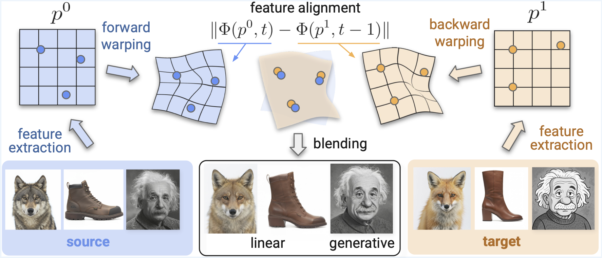

# FLOWING 🌊: Implicit Neural Flows for Structure-Preserving Morphing
[Arthur Bizzi [1]]()
[Matias Grynberg Portnoy [2]](https://www.linkedin.com/in/mgp123)
[Vitor Pereira Matias [3]]()
[Daniel Perazzo [1]](https://www.linkedin.com/in/daniel-perazzo-85a0a3175)
[João Paulo Lima [1,4]](https://jpsml.github.io)
[Luiz Velho [1]](https://lvelho.impa.br/),
[Nuno Gonçalves [5,6]](https://home.deec.uc.pt/~nunogon/)
[Guilherme Schardong [5]](https://schardong.github.io/),
[Tiago Novello [1]](https://sites.google.com/site/tiagonovellodebrito),
<br>
[1] Institute for Pure and Applied Mathematics (IMPA),
<br>
[2] Buenos Aires University (UBA),
<br>
[3] University of São Paulo (USP),
<br>
[4] Rural Federal University of Pernambuco (UFRP)
<br>
[5] Institute of Systems and Robotics, University of Coimbra (ISR-UC),
<br>
[6] Portuguese Mint and Official Printing Office (INCM)

This is the official implementation of "FLOWING 🌊: Implicit Neural Flows for Structure-Preserving Morphing", to appear on NeurIPS 2025. Meanwhile, check the [arXiv version](https://arxiv.org/). More results and examples in the [project page](https://schardong.github.io/flowing).



## Getting started


**TL-DR**:If you just want to run the code, follow the steps below (assuming a UNIX-like system with Make installed). For more details, jump to `Setup and sample run` section.

```{sh}
python -m venv .venv
source .venv/bin/activate
pip install -r requirements.txt
pip install -e .
...
```
